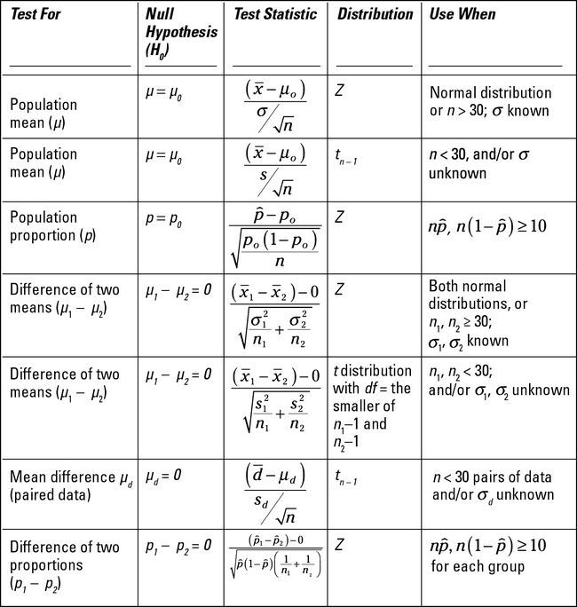

## Referencias recomendadas:

Para un texto más detallado que este mire:

-   Prueba de Hipótesis Estadística: una explicación desde cero. PROBA FÁCIL (2018).
<https://probafacil.com/prueba-de-hipotesis-estadistica>. 

Es una explicación simple, sin detalles matemáticos que cubre todo lo necesario para nuestros objetivos. 

Para una explicación más rigurosa y detallada recomiendo (no está en línea):

-   Batista William (2020). Introducción a la inferencia estadística aplicada. 2da Ed. Editorial Facultad de Agronomía. 272 pgs. <https://www.agro.uba.ar/catalog/introducci-n-la-inferencia-estad-stica-aplicada-3ra-edici-n>

# Introducción

El método científico parte de una pregunta que sugiere hipótesis científicas de las que se derivan predicciones (cuando se realiza un experimento). Las predicciones implican recopilar datos y plantear hipótesis estadísticas sobre los mismos. El rechazo de las hipótesis estadísticas permiten deducir algo acerca de la pregunta original.

Una hipótesis científica es por lo tanto un postulado categórico que puede refutarse (falsacionismo de Karl Popper) y busca entender las causas de los fenómenos observados. Las hipótesis estadísticas son similares salvo por que no hablan sobre las causas, se refieren únicamente a las asociaciones entre variables, la interpretación de las asociaciones es potestad del científico.

La refutación de una hiopótesis cuando hay incertidumbre se puede hacer de modo probabilístico, es decir que siempre habrá cierta probabilidad de error. Por lo tanto lo que debemos hacer es controlar el error. Por un lado debemos decidir qué error es razonable asumir y por otro debemos medir la probabilidad de error al tomar una decisión. Ambos asuntos tienen su dificultad y particularidades. Por ahora nos centraremos en el cálculo de la probabilidad de error.

Al poner a prueba una hipótesis hay siempre dos tipos de error que podemos cometer, por un lado rechazar una hipótesis verdadera (Error de tipo I) y por otro aceptar una hipótesis falsa (Error de tipo II). El siguiente cuadro resume la situación.

|                    |                     |                       |
|:------------------:|:-------------------:|:---------------------:|
|                    |    **H0 Verdadera** |      **H0 Falsa**     |
|  **Rechazar H0**   | Error de tipo I (⍺) |    Correcto (1-𝛽)    |
| **No Rechazar H0** |   Correcto (1-⍺)    | Error de tipo II (𝛽) |

⍺: es la magnitud del error de tipo I que estamos dispuestos a aceptar
𝛽: es la magnitud del error de tipo II que estamos dispuestos a aceptar

⍺ y 𝛽 los fijamos antes de poner a prueba las hipótesis. Esto depende de nuestro conocimiento acerca del fenómeno investigado (conocimiento disciplinar) y de la evaluación del riesgo que hagamos (aquí la estadística también tiene herramientas para asistirnos). Más adelante discutiremos esta decisión más en profundidad. 

# Tipos de pruebas de hipótesis

Existen muchas pruebas de hipótesis posibles. Las más importantes (porque cubren la mayoría de los casos) se resument en el siguiente cuadro.

|                              |                |                        |                       |               |
|:-----------------------------|:---------------|:----------------------:|:---------------------:|:-------------:|
|                              |                |**Unilateral Izquierda**|**Unilateral Derecha** |**Bilateral**  |
|  **Una media poblacional**   |                |  H0) 𝝁 ≥ 𝝁0          |  H0) 𝝁 ≤ 𝝁0         |  H0) 𝝁 = 𝝁0 |
| **Dos medias poblacionales** | apareadas      |  H0) 𝝁1 ≥ 𝝁2         |  H0) 𝝁1 ≤ 𝝁2        |  H0) 𝝁1 = 𝝁2|
| **Dos medias poblacionales** | independientes |  H0) 𝝁1 ≥ 𝝁2         |  H0) 𝝁1 ≤ 𝝁2        |  H0) 𝝁1 = 𝝁2|

Cada hipótesis nula (H0) de la tabla tiene una H1 alternativa que hace a las dos hipótesis exhaustivas, es decir que cubren todos los resultados posibles.

Todas estas hipótesis se prueban en principio con una distribución T de Student. Existen otras posibles distribuciones para casos particulares. Existen además otras pruebas posibles, por ejemplo para probar diferencias en proporciones, o testear normalidad en una distribución, o si una correlación es significativa, etc.. En general son adaptaciones de estas mismas pruebas. Veremos algunas de ellas más adelante.

Lo que cambia en cada caso es el estadístico de prueba, es decir el valor que comparo con la distribución de probabilidad (en este caso T de Student). Esto es lo que me permite calcular el la probabilidad de error (valor-p).

## Estadísticos de prueba.

La siguiente tabla es un resumen acerca de los tipos básicos de pruebas de hipótesis. Con esta tabla podrá realizar la mayoría de las pruebas de hipótesis para variables cuantitativas. Fué tomada de: <https://maniqui-es.com/educacin-y-lenguas/matemticas/estadsticas/18655-manejo-de-pruebas-de-hiptesis-estadsticas.html>

Nótese que no diferencia entre población y muestra, sólo muestra el aspecto matemático de la diferencia indicando el desvío estandar como sigma o S. Las pruebas sobre la población usan una distribución Z, que es la Normal estandarizada. En cambio las pruebas sobre la muestra usan una distribución T de Student.



# Pasos para realizar las pruebas de Hipótesis

1.  Formular dos hipótesis estadísticas. (la nula H0 y la alternativa H1)
2.  Elegir el máximo riesgo de rechazar equivocadamente la hipótesis nula (H0). (⍺, límite para el error de tipo I)
3.  Generar los datos necesarios.
4.  Evaluar el grado de concordancia entre los datos y H0 (valor-p).
5.  Compara el valor-p con ⍺ y decidir si se rechaza o no H0.
6.  Si No rechazamos H0 debemos evaluar la probabilidad de cometer error de tipo II (a este asunto le dedicaremos otro notebook). 

# Diferencia estadísticamente significativa.

Se usan las expresiones "diferencia significativa" y "diferencia no significativa". 

Existe diferrencia estadísticamente significativa cuando rechazamos la hipótesis nula, es decir que el "valor-p" es menor a "⍺". Esto significa que cometemos un error menor al aceptable al decir que NO es cierto que las medias comparadas son iguales (H0), y por lo tanto aceptamos la hipótesis alternativa (H1), que dice que las medias son diferentes entre sí.

Cuando el "valor-p" es mayor a "⍺", decimos que las diferencias medidas son "no significativas" (no decimos que no existen, para esto deberíamos evaluar el error de tipo II). Es decir que las diferencias no son suficientemente grandes como para asegurar con baja probabilidad de equivocarnos que los datos obtenidos son diferentes entre las dos poblaciones de referencia.

# Análisis de casos concretos.

## Medición de reflejos

Vamos a utilizar los datos procesados del notebook "05 - Ejercicios - Tendencia central y varianza - Reflejos.Rmd". En el notebook original hay una descripción del experimento.

```{r}
library(tidyverse)
library(BSDA)
# library(nortest)
# library(ggplot2)
# library(moments)
```

```{r}
reflejosTidy <- read_csv("datos/reflejos_tidy.csv")
```

Vamos a excluir algunos outliers que distorsionan los datos. Los detalles acerca de las razones para la exclusión mírelas en el notebook original.

```{r}
reflejosTidy <- reflejosTidy %>% filter(DISTANCIA < 30) %>% filter(NOMBRE != "MARIO")
head(reflejosTidy)
```

### Muestreo

Además vamos a submuestrear las mediciones originales para observar el efecto del tamaño de las muestras (cantidad de repeticiones) sobre el valor-p (p-value). Esto es suponer que hubieramos tomado menos repeticiones, por eso seleccionamos con el número de orden. Primero observe los resultados con todas las repeticiones y luego descomente la línea siquiente y ejecute el notebook nuevamente para comparar los resultados.

```{r}
# reflejosTidy <- reflejosTidy %>% filter(ORDEN <= 10)
```

### Comparación de una muestra con un valor de referencia. (Una media poblacional, unilateral izquierda)

Suele considerarse que el tiempo de reacción media de una persona normal (al realizar una tarea simple) que está atenta al estímulo varía alrrededor de 0.22 segundos. Este valor puede variar de acuerdo a las circunstancias (depende cómo se lo mida, si la persona está entrenada -como los deportistas-, qué estímulo desencadena la respuesta, qué respuesta se considera, la complejidad de la decisión,etc.). Queremos verificar si las personas que hicieron el experimento tienen reflejos más rápidos al promedio poblacional. Para este caso vamos a usar 0.22 segundos como valor de referecia.

Por lo tanto nuestras hipótesis serían:

$$
H_{0}: \mu \geq 0.22 \\
H_{1}: \mu < 0.22
$$

### Primero un BoxPlot

```{r}
mu <- 0.22 # es el valor de referencia en nuestras hipótesis
```

```{r}
ggplot(reflejosTidy) +
  aes(x = NOMBRE, y = TIEMPO) +
  geom_boxplot() +
  geom_jitter(width = 0.2, alpha = 0.5, color = "blue") +
  ylim(c(0, 0.25)) +
  geom_hline(yintercept = mu)
```

#### Suponiendo que conocemos la varianza de la población.

Primero vamos a calcular los parámetros necesarios. Como lo que necesitaremos es el desvío estándar lo calcularemos en lugar de la varianza.

La varianza de la población la calcularemos como la varianza de las mediciones de las 3 personas medidas. (es una suposición que no debe estar muy alejada de la realidad, pero deberíamos ser cuidadosos con esa suposición).

```{r}
desvioEstandarPoblacion <- sd(reflejosTidy$TIEMPO)
desvioEstandarPoblacion
```

Además elegiremos como un error máximo aceptable el 5%, es decir que alfa = 0.05. Esto quiere decir que si aceptamos H0, lo hacemos con el 95% de confianza.

Probaremos las hipótesis para cada persona por separado.

```{r}
persona <- "RAFA" # "RAFA" "NACHO" "LAUTA"
muestraUnaPersona <- reflejosTidy %>% filter(NOMBRE == persona) 
```

Usamos una distribución Normal Estandarizada. El estadístico de prueba es:

$$
\frac{\bar{x} - \mu_0}{\frac{\sigma}{\sqrt{n}} } 
$$

```{r}
media0 <- mean(muestraUnaPersona$TIEMPO)
n <- nrow(muestraUnaPersona)

estadisticoDePrueba <- (media0- mu) / (desvioEstandarPoblacion / sqrt(n))

media0
n
estadisticoDePrueba

pnorm(estadisticoDePrueba, mean = 0, sd = 1, lower.tail = TRUE) # Usamos mean = 0 y sd = 1 porque es una Distribución Normal Estandarizada
```

Todo ese procedimiento anterior lo realiza directamente sobre la muestra el z.test(). Si no especificamos sigma.x lo calcula en base a la muestra, en nuestro caso lo calculamos en base a los datos de las 3 personas, por eso debemos indicarselo. (el z.test() no está en R-base, por eso cargamos al inicio el paquete BSDA)

```{r}
zTestPersona <- z.test(muestraUnaPersona$TIEMPO, alternative='less', mu = mu, sigma.x = desvioEstandarPoblacion) # la H1 dice que la media real es menor a mu, eso se especifica con "less". Podría ser también "two.sided" o "greater" 
zTestPersona
```

```{r}
errorEstandarPoblacion <- desvioEstandarPoblacion / sqrt(n)
rango = c(min(mu - 3 * errorEstandarPoblacion, media0), mu + 3 * errorEstandarPoblacion)
ggplot(data.frame(x = rango), aes(x = rango)) +
  stat_function(fun = dnorm, n = 101, args = list(mean = mu, sd = errorEstandarPoblacion)) +
  geom_area(stat = 'function', fun = dnorm, args = list(mean = mu, sd = errorEstandarPoblacion), fill = '#ff0018', xlim = c(rango[1], media0), alpha = 0.5) +
  geom_vline(xintercept = mu) +
  geom_label(aes(x = media0, y = -7, label = round(media0,3)))  +
  ylab("Densidad") + ggtitle("Distribución Normal") + xlab("tiempo de respuesta (seg)")
```

```{r}
rango = c(min(-3,zTestPersona$statistic-1), 3)
ggplot(data.frame(x = rango), aes(x = rango)) +
  stat_function(fun = dnorm, n = 101, args = list(mean = 0, sd = 1)) +
  geom_area(stat = 'function', fun = dnorm, args = list(mean = 0, sd = 1), fill = '#ff0018', xlim = c(rango[1],zTestPersona$statistic), alpha = 0.5) + 
  geom_vline(xintercept = zTestPersona$statistic) +
  geom_label(aes(x = zTestPersona$statistic, y = -0.02, label = round(zTestPersona$statistic,3))) +
  geom_label(aes(x = zTestPersona$statistic, y = 0.1, label = zTestPersona$p.value)) +
  ylab("Densidad") + ggtitle("Distribución Normal Estándar") + xlab("tiempo Normalizado")
```

#### Suponiendo que NO conocemos la varianza de la población.

Probaremos las hipótesis para cada persona por separado.

Usamos una distribución T de Student. El estadístico de prueba es:

$$
\frac{\bar{x} - \mu_0}{\frac{s}{\sqrt{n}} } 
$$

```{r}
media0<- mean(muestraUnaPersona$TIEMPO)
desvioEstandarMuestra <- sd(muestraUnaPersona$TIEMPO)
n <- nrow(muestraUnaPersona)

estadisticoDePrueba <- (media0- mu) / (desvioEstandarMuestra / sqrt(n))

media0
desvioEstandarMuestra
n
estadisticoDePrueba
pt(estadisticoDePrueba, df = n - 1, lower.tail = TRUE)
```

Todo ese procedimiento anterior lo realiza directamente sobre la muestra el t.test()

```{r}
tTestPersona <- t.test(muestraUnaPersona$TIEMPO, alternative = "less", mu = mu) # la H1 dice que la media real es menor a mu, eso se especifica con "less". Podría ser también "two.sided" o "greater"
tTestPersona
```

```{r}
rango = c(min(-3,tTestPersona$statistic-1), 3)
ggplot(data.frame(x = rango), aes(x = rango)) +
  stat_function(fun = dt, args = list(df = tTestPersona$parameter)) +
  geom_area(stat = 'function', fun = dt,  args = list(df = tTestPersona$parameter), fill = '#ff0018', xlim = c(rango[1],tTestPersona$statistic), alpha = 0.5) + 
  geom_vline(xintercept = tTestPersona$statistic) +
  geom_label(aes(x = tTestPersona$statistic, y = -0.02, label = round(tTestPersona$statistic,3))) +
  geom_label(aes(x = tTestPersona$statistic, y = 0.1, label = tTestPersona$p.value))  +
  ylab("Densidad") + ggtitle("Distribución T de Student") + xlab("tiempo Normalizado")
```

Interpretación: (para el caso de RAFA y con la muestra completa - n = 29-) como el valor-p (0.003941) es menor a 0.05 rechazamos H0 y por lo tanto concluímos que el tiempo de respuesta de "RAFA" es menor al 0.22 que es el promedio poblacional supuesto (H1 es verdadera).

### Comparación de dos muestras. (Dos medias poblacionales independientes, bilateral)

Aquí vamos a comparar los tiempos de reacción de dos personas. Como a priori no tengo ninguna razón para suponer que una de las personas tiene menor tiempo de respuesta que otra, las hipótesis se plantean como igual o distinto.

En este caso las muestras NO son apareadas ya que cada medición es independiente.

$$
H_{0}: \mu_A = \mu_B \\
H_{1}: \mu_A \neq \mu_B
$$ 

Que es lo mismo que decir:

$$
H_{0}: \mu_A - \mu_B = 0\\
H_{1}: \mu_A - \mu_B \neq 0
$$

Este segundo par de hipótesis es lo que en realidad pone a prueba el test T (lea atentamente la salida del método t.test() "alternative hypothesis: true difference in means is not equal to 0").

El estadístico de prueba para muestras independientes es:

$$
\frac{\bar{x}_1 - \bar{x}_2}{ s_a \cdot \sqrt{\frac{1}{n_1} + \frac{1}{n_2}}}
$$

donde S²a es la varianza amalgamada, que es muy parecida a una varianza promedio.

$$
S^2_a = \frac{(n_1 - 1) \cdot S^2_1 + (n_2 - 1) \cdot S^2_2}{ n_1 + n_2 - 2}
$$

```{r}
 # "RAFA" "NACHO" "LAUTA"
p1 <- "NACHO"
p2 <- "RAFA"
muestraP1 <- reflejosTidy %>% filter(NOMBRE == p1)
nP1 <- nrow(muestraP1)
mediaP1 <- mean(muestraP1$TIEMPO)
varP1 <- var(muestraP1$TIEMPO)
# eeP1 <- sqrt(varP1) / sqrt(nP1)
eeP1 <- sd(muestraP1$TIEMPO) / sqrt(nP1)

muestraP2 <- reflejosTidy %>% filter(NOMBRE == p2)
nP2 <- nrow(muestraP2)
mediaP2 <- mean(muestraP2$TIEMPO)
varP2 <- var(muestraP2$TIEMPO)
# eeP2 <- sqrt(varP2) / sqrt(nP2)
eeP2 <- sd(muestraP2$TIEMPO) / sqrt(nP2)

s2A <- ((varP1 * (nP1 - 1)) + (varP2 * (nP2 - 1))) / (nP1 + nP2 - 2) # varianza amalgamada, es parecida al promedio de las dos varianzas
estadisticoDePrueba <- (mediaP1 - mediaP2) / (sqrt(s2A) * sqrt((1 / nP1) + (1 / nP1))) 
estadisticoDePrueba

2 * pt(estadisticoDePrueba, df = (nP1 + nP2 - 2), lower.tail = TRUE)
```

```{r}
rango = c(min(mediaP1 - 3 * eeP1, mediaP2 - 3 * eeP2), max(mediaP1 + 3 * eeP1, mediaP2 + 3 * eeP2))

ggplot(data.frame(x = rango), aes(x = rango)) +
  stat_function(fun = dnorm, n = 101, args = list(mean = mediaP1, sd = eeP1), color = "blue") +
  stat_function(fun = dnorm, n = 101, args = list(mean = mediaP2, sd = eeP2), color = "darkgreen") +
  geom_vline(xintercept = mediaP1, color = "blue") +
  geom_vline(xintercept = mediaP2, color = "darkgreen") +
  geom_label(aes(x = mediaP1, y = -0.02, label = round(mediaP1,3))) +
  geom_label(aes(x = mediaP2, y = -0.02, label = round(mediaP2,3))) +
  geom_label(aes(x = mediaP1, y = 150, label = p1)) +
  geom_label(aes(x = mediaP2, y = 150, label = p2)) +
  ylab("Densidad") + ggtitle("Distribución Normal") + xlab("Tiempo de Respuesta (seg)")
```

```{r}
tTestDiferencia <- t.test(muestraP1$TIEMPO, muestraP2$TIEMPO, alternative = "two.sided", paired = FALSE) #  "less" "two.sided" "greater" Además puede agregar la opción , var.equal = TRUE 
tTestDiferencia
```

Nótese que este método realizó el test de Welch en vez del de Student, las diferencias son leves y se deben a un leve ajuste que hace cuando calcula el estadístico de Prueba y los grados de libertad. Este ajuste depende de las diferencias entre las varianzas de las dos muestras. Cuando las varianzas son iguales, los dos test dan el mismo resultado. Puede verificar esto al comparar RAFA con LAUTA (varianzas diferentes) o RAFA con NACHO (varianzas parecidas).


```{r}
rango = c(min(-3,tTestDiferencia$statistic-1), 3)

ggplot(data.frame(x = rango), aes(x = rango)) +
  stat_function(fun = dt, args = list(df = tTestDiferencia$parameter)) +
  geom_area(stat = 'function', fun = dt, args = list(df = tTestDiferencia$parameter), fill = '#ff0018', xlim = c(rango[1],tTestDiferencia$statistic), alpha = 0.5) + 
  geom_vline(xintercept = tTestDiferencia$statistic) +
  geom_label(aes(x = tTestDiferencia$statistic, y = -0.02, label = round(tTestDiferencia$statistic,3))) +
  geom_label(aes(x = tTestDiferencia$statistic, y = 0.1, label = tTestDiferencia$p.value))  +
  ylab("Densidad") + ggtitle("Distribución T de Student") + xlab("Diferencia de tiempo Normalizado")
```
